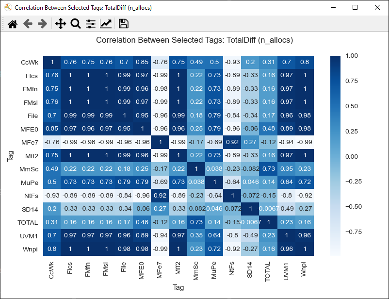
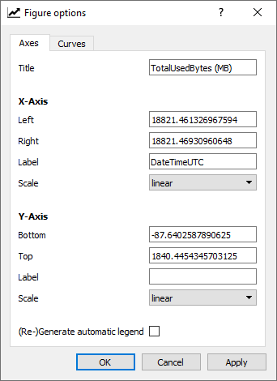
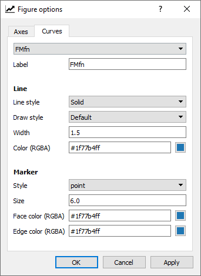
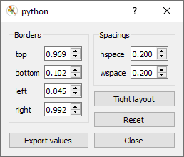

# PoolmonViz
A visualizer for poolmon tags plotted over time

#### Table of Contents
- [Overview](#overview)
   - [Correlation Matrix](#correlation-matrix)
- [Screenshots](#screenshots)
- [Usage of Analyzer](#usage-of-analyzer)
- [Setup](#setup)


## Overview
In the Windows kernel, the heap memory allocation routines take an optional *tag* that can be used to debug memory leaks. Various tools like poolmon and windbg can display statistics that indicate the total amount of memory used by each tag, which can then be used to narrow down the problem.

However, the statistics reported by these tools are snapshots in time, and do not provide any indication as to which tags are growing and which are not. Kernel developers will often take multiple snapshots over time and compare them manually. This, obviously is a tedious process.

Things become even more challenging when the memory leak is small and accumulates over months. Such memory leaks rarely show up as top users and are easily missed.

PoolmonViz consists of two parts
* *poolmon-powershell.ps1*
* *visualize.py*

*poolmon-powershell.ps1* periodically collects snapshots of memory usage and stores them as a set of CSV files in the directory from which it is launched. The periodicity and duration of collection can be controlled by modifying the last line of the script.

Once *poolmon-powershell.ps1* has collected all the different CSV files, *visualize.py* can then be invoked to create a plot of the memory usage of each tag over time. By default, the following tags are plotted
* 5 top tags that have the highest peak usage
* 5 top tags that have the highest average usage
* 5 top tags that show the biggest percentage increase
* 5 top tags that show the biggest absolute increase

*visualize.py* has several options that allow it to plot either the total size per tag, or the number of allocations per tag, and is controlled by the *-t/--type* command line option.

The plot can be further drilled down into by clicking the *loupe* icon and then selecting a part of a graph to magnify. This can be very helpful when multiple tags seem to overlap.

Another tool that is available on Windows is the *Figure options* which can be accessed by the icon next to the *save* icon. This allows changing the marker-type, line-style and color for each tag. This is very useful when several tags mirror each other in allocation patterns.

#### Correlation Matrix
Sometimes different tags mirror each other. An example would be if a driver maintains a data structure for every open file handle, and that would mirror the file system tags on Windows Nt*. Such usage would be expected and would normally not be a leak. However, in case there is a leak, it may be difficult to nail down and separate from normal usage. Conversely, in case there isn't any leak, it may be difficult to conclude there is no leak. For such scenarios, this tool computes the correlation between tags, and is best used with the number of allocations rather than the total size (*TotalDiff/PagedDiff/NonPagedDiff*). Correlation values can be between -1 and 1. A correlation value of 1 means that they are a 100% related. A correlation value of -1 means that as one tag increases the other decreases. A correlation value of 0 indicates that the two tags are unrelated. Correlation is not displayed by default as computing it is somewhat slow, but can be turned on by using the folllowing options:
* *--show-correlation/-sc* : this displays correlation between tags that have been selected. This is expected to be used most often.
* *--show-correlation-extended/-sce* : this displays correlation between all tags. The output of this may be quite cluttered and hard to read, but zooming in using the *loupe* tool is an option.

The correlation metric used here is Pearson Correlation Coefficient.

## Screenshots




  

## Usage of Analyzer
Please invoke the python script as follows:

```
usage: visualize.py [-h] -d DIRECTORY -t {TotalUsedBytes,PagedDiff,NonPagedDiff,TotalDiff,PagedUsedBytes,NonPagedUsedBytes} [-ts {DateTimeUTC,DateTime}] [-it INCLUDE_TAGS [INCLUDE_TAGS ...]] [-et EXCLUDE_TAGS [EXCLUDE_TAGS ...]]
                    [-nmc N_MOST_CHANGED_TAGS] [-nmca N_MOST_CHANGED_TAGS_ABSOLUTE] [-nh N_HIGHEST_USAGE_TAGS] [-nha N_HIGHEST_AVERAGE_USAGE_TAGS] [-sc] [-sce]

optional arguments:
  -h, --help            show this help message and exit
  -d DIRECTORY, --directory DIRECTORY
                        The directory where the CSV files reside
  -t {TotalUsedBytes,PagedDiff,NonPagedDiff,TotalDiff,PagedUsedBytes,NonPagedUsedBytes}, --type {TotalUsedBytes,PagedDiff,NonPagedDiff,TotalDiff,PagedUsedBytes,NonPagedUsedBytes}
                        Type of plot, valid values
  -ts {DateTimeUTC,DateTime}, --time-stamp {DateTimeUTC,DateTime}
                        Which timestamp to use
  -it INCLUDE_TAGS [INCLUDE_TAGS ...], --include-tags INCLUDE_TAGS [INCLUDE_TAGS ...]
                        List of tags that must be included
  -et EXCLUDE_TAGS [EXCLUDE_TAGS ...], --exclude-tags EXCLUDE_TAGS [EXCLUDE_TAGS ...]
                        List of tags that must be excluded
  -nmc N_MOST_CHANGED_TAGS, --n-most-changed-tags N_MOST_CHANGED_TAGS
                        Number of tags that show highest growth
  -nmca N_MOST_CHANGED_TAGS_ABSOLUTE, --n-most-changed-tags-absolute N_MOST_CHANGED_TAGS_ABSOLUTE
                        Number of tags that show highest growth (absolute)
  -nh N_HIGHEST_USAGE_TAGS, --n-highest-usage-tags N_HIGHEST_USAGE_TAGS
                        No of tags that have the highest peak usage
  -nha N_HIGHEST_AVERAGE_USAGE_TAGS, --n-highest-average-usage-tags N_HIGHEST_AVERAGE_USAGE_TAGS
                        No of tags that have the highest average usage
  -sc, --show-correlation
                        Show correlation between selected tags
  -sce, --show-correlation-extended
                        Show correlation between all tags

```

Example:
```
python analyze.py -d . -t TotalUsedBytes -et MmSt -it mfel FxL2 -nmc 2 -nh 2
```

## Setup

This tool requires python in addition to powershell. Anaconda is the recommended distribution of python.

Additionally, the visualizer requires the following python packages:
* Numpy
* Pandas
* Matplotlib
* Seaborn

The steps to install Anaconda can be found on the [Anaconda Site](https://docs.anaconda.com/anaconda/install/).
Individual python packages can be installed using the steps mentioned [here](https://docs.anaconda.com/anaconda/navigator/tutorials/pandas/). Please use these steps to install numpy, pandas, matplotlib and seaborn.


