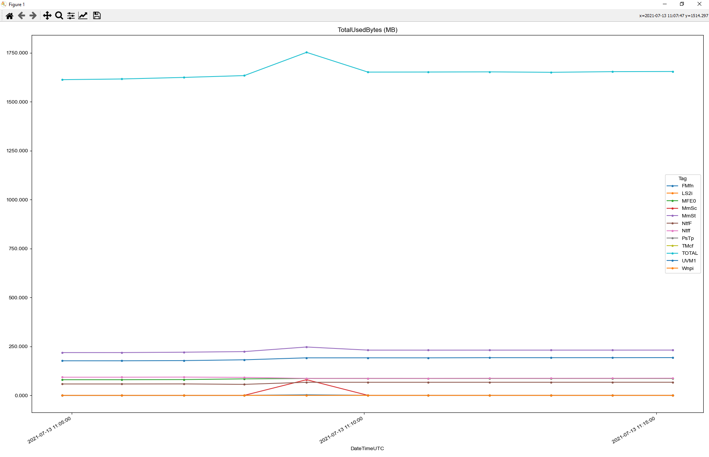

# PoolmonViz
A visualizer for poolmon tags plotted over time

## Overview
In the Windows kernel, the heap memory allocation routines take an optional *tag* that can be used to debug memory leaks. Various tools like poolmon and windbg can display statistics that indicate the total amount of memory used by each tag, which can then be used to narrow down the problem.

However, the statistics reported by these tools are snapshots in time, and do not provide any indication as to which tags are growing and which are not. Kernel developers will often take multiple snapshots over time and compare them manually. This, obviously is a tedious process.

Things become even more challenging when the memory leak is small and accumulates over months. Such memory leaks rarely show up as top users and are easily missed.




## Usage of Analyzer
Please invoke the python script as follows:

```
usage: Analyze Poolmon [-h] -d DIRECTORY -t
                       {TotalUsedBytes,PagedDiff,NonPagedDiff,TotalDiff,PagedUsedBytes,NonPagedUsedBytes}
                       [-ts {DateTime,DateTimeUTC}] [-it INCLUDE_TAGS [INCLUDE_TAGS ...]]
                       [-et EXCLUDE_TAGS [EXCLUDE_TAGS ...]] [-nmc N_MOST_CHANGED_TAGS] [-nh N_HIGHEST_USAGE_TAGS]
                       [-nha N_HIGHEST_AVERAGE_USAGE_TAGS]

optional arguments:
  -h, --help            show this help message and exit
  -d DIRECTORY, --directory DIRECTORY
                        The directory where the CSV files reside
  -t {TotalUsedBytes,PagedDiff,NonPagedDiff,TotalDiff,PagedUsedBytes,NonPagedUsedBytes}, --type {TotalUsedBytes,PagedDiff,NonPagedDiff,TotalDiff,PagedUsedBytes,NonPagedUsedBytes}
                        Type of plot, valid values
  -ts {DateTime,DateTimeUTC}, --time-stamp {DateTime,DateTimeUTC}
                        Which timestamp to use
  -it INCLUDE_TAGS [INCLUDE_TAGS ...], --include-tags INCLUDE_TAGS [INCLUDE_TAGS ...]
                        List of tags that must be included
  -et EXCLUDE_TAGS [EXCLUDE_TAGS ...], --exclude-tags EXCLUDE_TAGS [EXCLUDE_TAGS ...]
                        List of tags that must be excluded
  -nmc N_MOST_CHANGED_TAGS, --n-most-changed-tags N_MOST_CHANGED_TAGS
                        Number of tags that show highest growth
  -nh N_HIGHEST_USAGE_TAGS, --n-highest-usage-tags N_HIGHEST_USAGE_TAGS
                        No of tags that have the highest peak usage
  -nha N_HIGHEST_AVERAGE_USAGE_TAGS, --n-highest-average-usage-tags N_HIGHEST_AVERAGE_USAGE_TAGS
                        No of tags that have the highest average usage
```

Example:
```
python analyze.py -d . -t TotalUsedBytes -et MmSt -it mfel FxL2 -nmc 2 -nh 2
```


